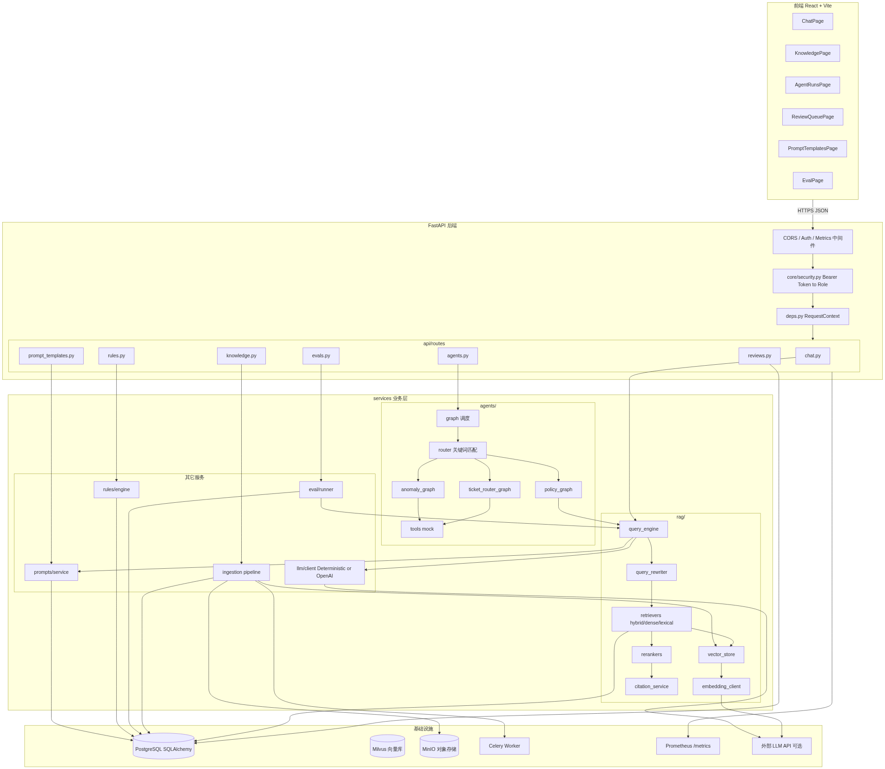
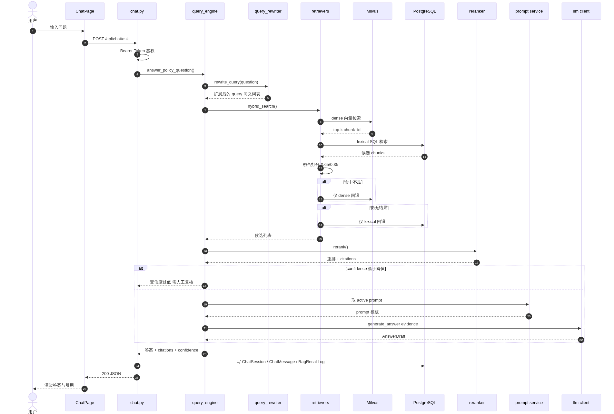
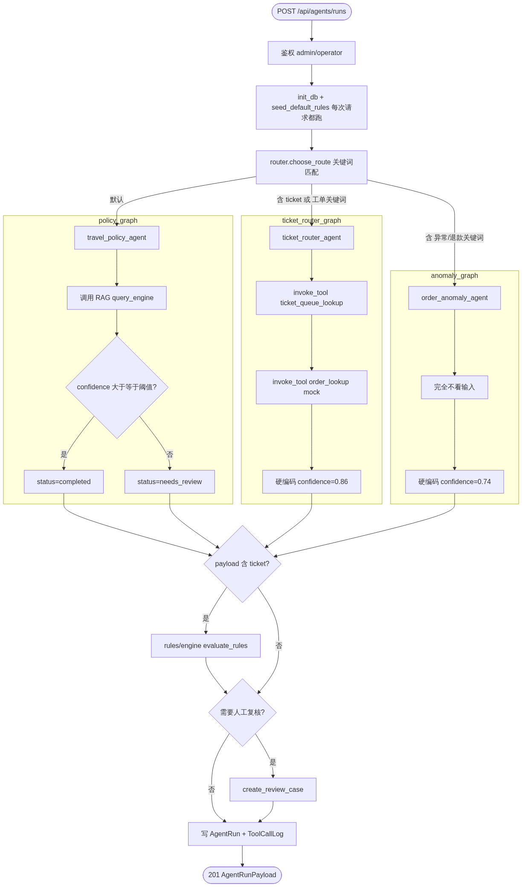
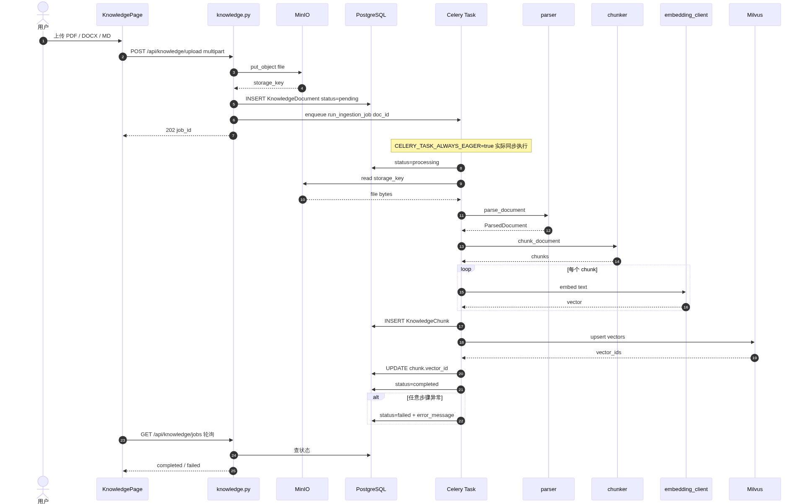
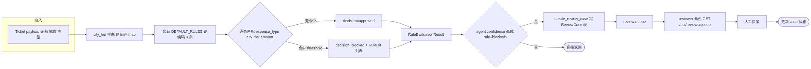
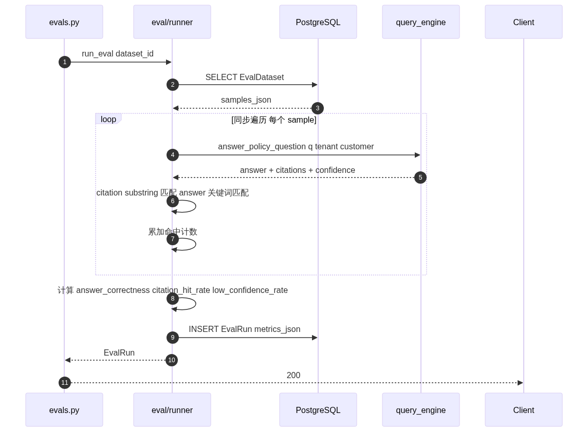
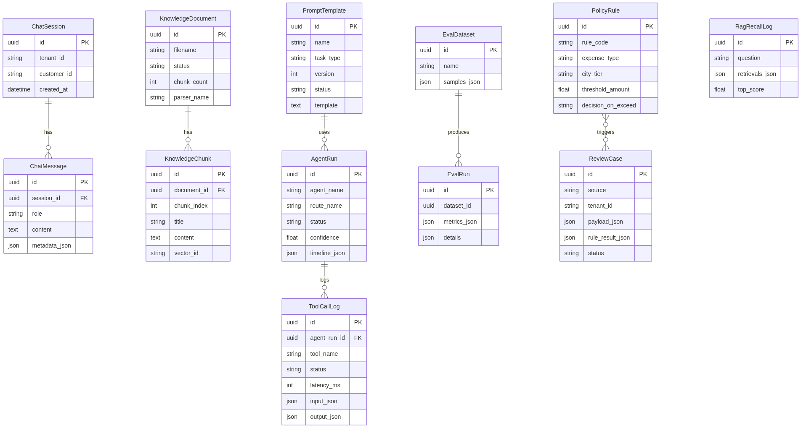
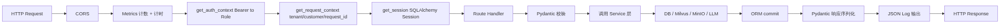

# Travel Ops Copilot 架构与流程评审

> 生成时间：2026-04-07
> 范围：backend / database / RAG / agents 四大板块
> 目的：工程评审 + 架构可视化，作为迭代路线图的基线文档

---

## 一、总体评分

**综合：5.0 / 10**（原型 → 早期 MVP 之间）

| 维度 | 分数 | 备注 |
|---|---|---|
| 架构分层 | 7 | routes → schemas → services → db 划分清晰 |
| 数据库设计 | 6 | ORM 规范，但缺迁移、缺约束、JSON 列滥用 |
| RAG 实现 | 5.5 | 混检 + rerank 思路对，但 embedding 是哈希假实现 |
| Agent 框架 | 3.5 | 关键词路由 + 大量硬编码，几乎没有真正的 agent loop |
| API / 安全 | 4 | Bearer Token 静态映射，租户隔离仅在应用层 |
| 可观测性 | 4 | JSON log + Prometheus 起步，无 tracing / 无审计 |
| 测试 | 4 | SQLite + noop vector store，没真集成测试 |
| 异步 / 扩展性 | 3 | 全同步、无缓存、`init_db` + `seed_default_rules` 每次请求都跑 |

**一句话总结**：思路是企业级的，实现是 demo 级的。把 embedding、agent loop、鉴权、迁移、async、tracing 这六块补齐后，再谈 production。当前状态适合作为内部 PoC 演示，不适合接真实业务流量。

---

## 二、后端核心问题

### 1. `app/db/session.py` 的 Session 工厂代理

```python
class _SessionLocalProxy:
    def __call__(self) -> Session:
        if engine != _session_factory.kw["bind"]:
            raise RuntimeError("session factory bind drift detected")
```

- 代理 + 断言的写法是为了对付测试 monkeypatch，**生产里完全没必要**
- 启动时 `Base.metadata.create_all()` 建表，**没有 Alembic 迁移** —— 企业级红线问题之一

### 2. `agents.py` 路由里每次请求都跑

```python
init_db()
seed_default_rules(session)
```

这两行该在 app startup 一次性执行，现在每个 `POST /api/agents/runs` 都重复，**纯属性能浪费 + 写库竞争**。

### 3. 没有 async / await

FastAPI 的 IO 优势完全没用上，RAG / LLM / Milvus / MinIO 全部 sync 调用，**单 worker 吞吐很差**。

### 4. 安全 / 多租户

- `core/security.py` 是 token → 角色 的内存字典，**没有过期、签名、撤销、审计**
- `tenant_id` / `customer_id` 完全由前端传入，**后端不校验请求 token 是否有权访问该租户** —— 这是企业项目最常见也最危险的越权漏洞
- `auth_enabled=false` 时直接给 admin 权限，dev 默认值 `admin-token` 一旦配置疏漏就是后门

### 5. 错误处理几乎为 0

- 没有自定义异常体系，没有 4xx / 5xx 区分
- LLM 客户端 `response.raise_for_status()` 后没有重试、降级、熔断
- ingestion pipeline 一个大 try / except 包住整流程，**根因被吞掉**

---

## 三、数据库层不合理点

1. **没有 Alembic**，schema 改动只能靠 drop & recreate
2. **JSON 列滥用**：`metadata_json / input_json / output_json / timeline_json / payload_json / samples_json / metrics_json` 一堆，能结构化的都塞 JSON，将来没法索引、没法做分析、没法 evolve schema
3. **缺 FK 约束**：`EvalRun.dataset_id` / `ReviewCase` 关联字段都没真正的外键，仅靠应用层约束
4. **没有软删除、没有版本字段、没有 audit 表**，企业级合规审计无从谈起
5. **多租户隔离仅在应用层**，没有 PostgreSQL RLS 或 schema 级隔离，违反 defense in depth
6. SQLAlchemy 用 sync session，对应 FastAPI 应该用 `AsyncSession`

---

## 四、RAG 部分的硬伤

### 1. `embedding_client.py` 的"确定性 embedding"是哈希分桶

```python
digest = hashlib.sha256(token.encode("utf-8")).digest()
bucket = int.from_bytes(digest[:4], "big") % dimension
vector[bucket] += 1.0
```

这**根本不是 embedding**，等价于一个稀疏 BoW + L2 normalize，**没有任何语义相似度能力**。但它是 default 行为，意味着没配 OpenAI 时整个 dense retrieval 是假的。测试套件依赖这个，导致 RAG 测试通过 ≠ RAG 真的好。

### 2. `vector_store.py` 的 Milvus 集成

- `collection.load()` 每次 search 都调一遍，Milvus 大忌，应该启动时 load 一次
- filter 表达式拼字符串，即使有 escape，**Milvus 表达式注入**风险仍在
- 索引硬编码 `AUTOINDEX`，没暴露 IVF / HNSW 参数
- `NoopVectorStore` 静默返回空，**生产配置错了不会报错**，只是检索不到东西

### 3. `query_rewriter.py` 是手写同义词表

```python
ALIAS_RULES = (
    ("住宿别名", ("住宿","住宿标准","hotel"), ("酒店","报销上限","住宿标准")),
    ...
)
```

三条规则，**完全不可扩展**。没有 LLM 改写、没有 HyDE、没有 multi-query。

### 4. `retrievers.py` 的混合检索

- 权重 `0.65 dense / 0.35 lexical` 硬编码
- 没有 RRF (Reciprocal Rank Fusion) 这种工业界标准融合方案
- lexical 走 SQL 全表加载到 Python 里算分，**不能 scale**

### 5. `query_engine.py` 的回退链

hybrid → vector → lexical，回退是静默的，**用户和日志都不知道用了哪条**，离线分析和 debug 极困难。confidence 阈值在代码里写死。

### 6. 缺失项

- 没有真正的 reranker（Cohere / bge-reranker）
- 没有 chunk overlap 策略可调、没有 semantic chunking
- 没有 retrieval evaluation（recall@k / nDCG），只有最末端的 substring 匹配
- 没有 query / answer 缓存

---

## 五、Agent 部分（最弱）

### 1. 这不是 Agent，是 if-else 路由 + 写死结果

```python
# anomaly_graph.py
return AgentExecutionResult(
    agent_name="order_anomaly_agent",
    confidence=0.74,                 # 写死
    output={"queue_name":"ops-review","reason":"异常订单类问题..."},
)
```

异常分析 agent **完全没看输入**，直接返回常量。`ticket_router` 的 confidence=0.86 也是常量。

### 2. `router.py` 用关键词匹配选 agent

- 没有 LLM 路由、没有 embedding 路由、没有 fallback
- 改 agent 必须改代码，**没有注册中心**

### 3. 没有真正的 agent loop

所有 graph 都是"调一次工具 → 返回"，**不存在 ReAct / Plan-and-Execute / 多步推理**。`graph.py` 起的名字让人误以为是 state machine，实际是顺序调用。

### 4. 工具系统是 mock

`tools.py` 里 `lookup_order_details()` 直接返回硬编码 sandbox 数据，**没有外部 API 调用**，没有 schema 校验、没有重试、没有超时。

### 5. 缺失项

- 无 agent memory（短期 / 长期）
- 无 human-in-the-loop 中断 / 恢复
- 无 token / cost 统计
- 无 trace export（OTEL / LangSmith / Phoenix）
- 无 guardrails（输入 / 输出过滤、PII 脱敏、prompt injection 检测）

---

## 六、最该优先修的"明显不合理"实现

1. `agents.py` 路由里调用 `init_db()` + `seed_default_rules()` → 移到 lifespan startup
2. `_SessionLocalProxy` 的 drift 断言 → 删掉
3. `DeterministicPolicyAnswerClient` 默认开启 → 改成只在测试 fixture 启用，生产缺失应**直接报错**
4. `seed_default_rules` 在请求路径上 → 改 startup 或 migration data seed
5. JSON 列里的 `timeline_json / tool_calls` → 抽出独立表
6. Milvus `collection.load()` per query → 启动时 load
7. 关键词路由 + 关键词同义词 → 至少接一个轻量 LLM 做意图分类 + query rewrite
8. `auth_enabled=false → admin` → 改成"未鉴权时拒绝所有写操作"
9. `tenant_id` 由 body 传入未校验 → 改成从 token claim 推断
10. 评估指标 substring 匹配 → 加 LLM-as-judge 或 embedding similarity

---

## 七、距离真正企业级的差距清单（按重要性）

**P0（不补就上不了生产）**
- Alembic 迁移
- 真 embedding 模型
- 真鉴权（JWT + RBAC + tenant claim）
- 全链路 tracing
- 错误体系与重试熔断
- 真集成测试（Testcontainers 起 PG + Milvus + MinIO）

**P1（决定能不能扩展）**
- async / await 改造
- Redis 缓存（embedding、检索、答案）
- 任务真异步（Celery 不要 eager）
- Milvus 索引参数与 partition
- 多租户 DB 级隔离

**P2（决定能不能运营）**
- prompt 版本管理 + A/B + 在线评估
- retrieval recall@k 离线评测
- agent trace export
- cost & token 统计
- 审计日志 + 数据脱敏

**P3（决定团队能不能维护）**
- OpenAPI 客户端生成
- 类型化的 timeline 事件
- Pre-commit + ruff / mypy strict
- Dockerfile + Helm
- SLO 与告警

---

## 八、整体架构图



---

## 九、RAG 问答流程（POST /api/chat/ask）



---

## 十、Agent 执行流程（POST /api/agents/runs）



---

## 十一、知识库 ingestion 流程（POST /api/knowledge/upload）



---

## 十二、规则引擎 + 人工复核流程



---

## 十三、评估流程（POST /api/evals/runs）



---

## 十四、数据库 ER 简图



---

## 十五、请求总生命周期（跨层视角）



> 红色风险点：`D`（静态 token 映射）是目前最弱的一环
> 绿色亮点：`I`（Service 层）是架构上最成熟的一环

---

## 十六、值得肯定的地方

- **分层与文件命名是工业级风格**，不是教程式的一坨 `main.py`
- 想到了 RAG 的 query rewrite / hybrid / rerank / citation / confidence / human review 这条完整链路（思路对，落地差）
- 想到了 prompt 模板表、规则引擎表、eval 数据集表、review 队列表，**领域建模有 sense**
- Pydantic + 类型注解 + frozen dataclass 用得还行

---

## 十七、后续迭代建议（下一个 Sprint 可交付）

最小闭环改造，一周内可落地：

1. **Embedding 真实化**：接入 `text-embedding-3-small` 或本地 `bge-m3`，保留 deterministic 作为 test fixture
2. **Lifespan 修复**：`init_db` + `seed_default_rules` 移入 FastAPI lifespan
3. **租户校验**：`get_request_context` 里强制 `tenant_id` 来自 token claim，body 里的仅作一致性校验
4. **Alembic 接入**：生成首次 baseline migration，禁用 `create_all`
5. **Async 改造起步**：`chat.py` + `query_engine.py` 先异步化，其它保持同步
6. **Agent 真 loop**：引入 `langgraph` 或自写最小 ReAct，把 `anomaly_graph` 从硬编码改成真推理

完成这 6 项后，评分应该能从 5.0 提到 6.5 左右。

---

*文档由 Claude 基于 `backend/` 源码全量静态分析生成，供团队工程评审与迭代规划使用。*
