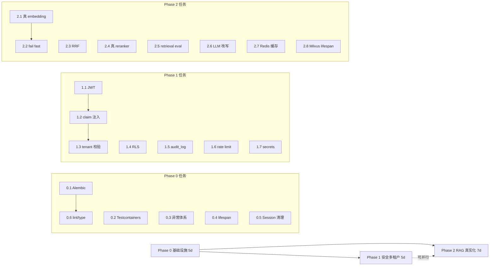

# 企业级迁移规划：Phase 0-2

> 生成时间：2026-04-07
> 执行人：Claude + 吕博智
> 目标：把 CL_agent 从 POC 升级到"准生产"可演示级别
> 总工期：约 17 工作日（2.5 周）
> 范围：Phase 0（基础设施） + Phase 1（安全多租户） + Phase 2（RAG 真实化）
> 不做：Phase 3 (Agent 真实化) / Phase 4 (Async) / Phase 5-7（留给下一轮迁移）

---

## 零、核心决策（已确认）

| 决策 | 选择 | 理由 |
|---|---|---|
| 目标范围 | Phase 0-2 | 个人作品升级到"不像玩具"的最小闭环 |
| LLM / Embedding 供应商 | OpenAI 兼容协议 | 一份代码接多家（OpenAI / DeepSeek / 智谱 / 通义 / Kimi） |
| 执行节奏 | 先完整规划，对齐后分阶段执行 | 避免返工，保证方向一致 |
| 分支策略 | `feat/phase-N-xxx` | 每阶段一分支，阶段末合并 main |
| Commit 格式 | `<type>: <desc>`（feat/fix/refactor/...） | 遵循仓库现有风格 |

---

## 一、前置基线（不动的东西）

本规划**不改**以下：

- 前端代码结构（Vue / React 不动）
- docker-compose 基础设施组合（PG / Milvus / MinIO / Celery）
- 现有 `/api/*` 路由 URL（保持向后兼容）
- 现有 11 张核心表的 PK/名字（可以加字段，不能改名）

本规划**会动**的关键文件：

```
backend/
├── app/
│   ├── core/           # 全部改造
│   ├── db/             # Alembic 接入 + RLS
│   ├── services/rag/   # Embedding 真实化 + RRF + reranker
│   └── api/            # 鉴权改造
├── tests/              # 集成测试重写
├── pyproject.toml      # 加依赖
└── alembic/            # 新增
```

---

## 二、Phase 总览与依赖关系



**关键依赖**：Phase 1.4 (RLS) 需要 1.1-1.3 完成（token → tenant_id → session 变量）；Phase 2.1 (真 embedding) 是 2.3/2.4/2.5 的前提。

---

## 三、Phase 0：基础设施补齐（5 天）

### P0.1 引入 Alembic ✅ 已完成（2026-04-07）

**实际交付**：
- `backend/alembic.ini` + `backend/alembic/env.py` + `backend/alembic/script.py.mako`
- `backend/alembic/versions/0001_baseline.py`（transition-style，内部用 `Base.metadata.create_all`）
- `backend/alembic/README.md`（legacy DB `alembic stamp` 升级路径）
- `backend/app/db/session.py` 新增 `ensure_schema()`：SQLite 走 `create_all`，PG 走 `alembic upgrade head` + legacy DB 自动 stamp baseline
- `Makefile` 加 `db-migrate / db-rollback / db-revision m="..." / db-stamp-baseline`

**验收结果**：
- `alembic heads` → `0001_baseline (head)` ✓
- 空 DB `alembic upgrade head` → 15 表（14 业务 + `alembic_version`）✓
- `alembic revision --autogenerate` 针对已 upgrade 的 DB → 空 diff（无模型漂移）✓
- `alembic downgrade base` → 只剩 `alembic_version` ✓
- `pytest -q` → 59 passed，无回归 ✓

**目标**：schema 改动受版本控制，不再依赖 `create_all`

**文件**：
- 新增 `backend/alembic.ini`
- 新增 `backend/alembic/env.py`
- 新增 `backend/alembic/versions/0001_baseline.py`
- 改 `backend/app/db/session.py`（删除 `init_db` 中的 `create_all`）
- 改 `backend/app/main.py`（启动时不再建表）
- 改 `Makefile`（加 `db-migrate` / `db-rollback` / `db-revision` 三个 target）

**实现要点**：
1. `pip install alembic` → 加到 pyproject.toml
2. `alembic init alembic` 生成骨架
3. `env.py` 里导入 `Base.metadata`，把 `target_metadata` 指过去
4. 把当前 PG 里的 schema 作为 baseline 生成 `0001_baseline.py`（`alembic revision --autogenerate`）
5. 测试环境改用 `alembic upgrade head` 替代 `create_all`
6. SQLite 测试仍保留 `create_all` 快速初始化（用 fixture 选择）

**验收**：
- `make db-migrate` 能跑
- 改一个 model 字段 → `alembic revision --autogenerate -m "xxx"` → 生成 migration 文件
- 删除 DB 后 `alembic upgrade head` 能完整重建

**预估**：1 天

**回滚**：删除 alembic/ 目录，恢复 `create_all`

---

### P0.2 引入 Testcontainers ✅ 已完成（2026-04-07）

**实际交付**：
- `backend/pyproject.toml`：加 `testcontainers[postgres,minio]>=4.9`；注册 `integration / unit` markers；默认 `addopts = "-m 'not integration'"`
- `backend/tests/integration/__init__.py` + `conftest.py`：session-scope PG 容器、MinIO 容器、自动 `alembic upgrade head`、每用例 `TRUNCATE ... RESTART IDENTITY CASCADE` 隔离
- Docker 健康检查带 3s 超时，没启 Docker Desktop 时快速 skip 不挂起
- 三个集成测试模块：
  - `test_ingestion_pipeline.py`：验真 MinIO 落对象 + 真 PG 落 KnowledgeDocument / KnowledgeChunk + 状态机
  - `test_agent_pipeline.py`：验真 PG 落 AgentRun + ToolCallLog + JSON 列 + over-threshold 触发 ReviewCase
  - `test_rag_pipeline.py`：验真 PG 落 ChatSession / ChatMessage / RagRecallLog + session 复用语义
- `Makefile` 加 `test-backend-full`（全部单元测试）和 `test-integration`（需要 Docker）
- `backend/tests/conftest.py`：autouse fixture 加 integration marker 检测，集成测试时不再覆盖 env

**P0.2 范围决策**：向量存储在集成测试里保持 `noop`，Milvus 的真容器集成推迟到 **P2.8**（那时 vector_store.py 本来就要改成支持 Milvus Lite / HNSW）。这样阶段职责干净，避免反复改同一个文件。

**验收结果**：
- `pytest -q`：59 passed, 6 deselected（单元测试零回归）✓
- `pytest -m integration -q`（无 Docker）：6 skipped in 6.57s（健康检查快速失败）✓
- `pytest -m integration -q`（Docker Desktop 起来后）：**待你启动 Docker 后验证**

**目标**：集成测试跑真 PG + Milvus + MinIO，不再全靠 SQLite + noop vector store

**文件**：
- 改 `backend/pyproject.toml`（加 `testcontainers[postgres]`，Milvus 用官方 docker-compose 片段）
- 新增 `backend/tests/integration/` 目录
- 新增 `backend/tests/integration/conftest.py`
- 新增 `backend/tests/integration/test_rag_pipeline.py`
- 新增 `backend/tests/integration/test_agent_pipeline.py`
- 新增 `backend/tests/integration/test_ingestion_pipeline.py`

**实现要点**：
1. `conftest.py` 用 pytest-xdist 支持容器按 session 复用
2. Postgres 容器用 testcontainers-python 起，拿 URL 塞进环境变量
3. Milvus 容器用 `wrouesnel/pymilvus-testcontainer` 或自写（测试容器 standalone 模式）
4. MinIO 用 testcontainers-minio
5. 跑集成测试时 `pytest -m integration`，CI 里单独 job
6. 单元测试保留原 SQLite + noop 方案，跑得快

**验收**：
- `pytest -m integration` 能在 CI 上跑通
- 覆盖三条主路径：`/api/chat/ask` / `/api/agents/runs` / `/api/knowledge/upload` → jobs

**预估**：1.5 天

**回滚**：不合并测试，单元测试不受影响

---

### P0.3 统一异常体系 ✅ 已完成（2026-04-07）

**实际交付**：
- `backend/app/core/errors.py`：`AppException` 基类 + 8 个领域异常子类（BadRequest / Unauthorized / Forbidden / NotFound / Conflict / Unprocessable / RateLimited / UpstreamError / ServiceUnavailable）
- `backend/app/schemas/errors.py`：`ErrorBody` + `ErrorResponse` Pydantic 模型（OpenAPI 友好）
- `backend/app/api/error_handlers.py`：4 个全局 handler —— `AppException` / `RequestValidationError` / `HTTPException`（legacy） / `Exception`（catch-all 500，不泄漏内部 message）
- `backend/app/main.py`：`create_app()` 里 `register_error_handlers(app)`
- 路由迁移示范：`knowledge.py` / `prompt_templates.py` / `evals.py` / `runtime_logs.py` 的 `HTTPException` 换成领域异常
- 响应体**双写兼容**：`{"detail": "...", "error": {"code", "message", "request_id", "details"}}`，老客户端读 `detail` 仍可工作
- `backend/tests/api/test_error_handlers.py`：6 个新测试覆盖所有 handler 分支

**验收结果**：
- 领域异常 → 结构化 body，含 `error.code` + `error.message` + `error.request_id` ✓
- Pydantic 校验错 → 422 + `error.details.fields` ✓
- UpstreamError → 502 + `UPSTREAM_ERROR` code ✓
- 未捕获 `Exception` → 500 + 不泄漏内部消息 ✓
- Legacy HTTPException → 同样统一 envelope ✓
- `pytest -q` → **65 passed**（零回归，+6 新测试）✓

**目标**：4xx / 5xx 区分清晰，错误响应有统一结构，不再把 500 当 400 抛

**文件**：
- 新增 `backend/app/core/errors.py`
- 改 `backend/app/main.py`（挂全局 exception handler）
- 改 `backend/app/api/routes/*.py`（把 `HTTPException` 替换为领域异常）
- 改 `backend/app/schemas/errors.py`（统一错误响应结构）

**实现要点**：

```python
# core/errors.py 轮廓
class AppException(Exception):
    status_code: int = 500
    error_code: str = "INTERNAL_ERROR"

class NotFound(AppException): status_code = 404; error_code = "NOT_FOUND"
class BadRequest(AppException): status_code = 400
class Unauthorized(AppException): status_code = 401
class Forbidden(AppException): status_code = 403
class Conflict(AppException): status_code = 409
class RateLimited(AppException): status_code = 429
class UpstreamError(AppException): status_code = 502
class ServiceUnavailable(AppException): status_code = 503

# 外部上游（LLM / Milvus / MinIO）错误统一包装成 UpstreamError
```

响应体结构：
```json
{
  "error": {
    "code": "NOT_FOUND",
    "message": "chat session not found",
    "request_id": "abc-123",
    "details": {}
  }
}
```

**验收**：
- 写一个测试：LLM 服务挂了 → 接口返回 502 而不是 500
- 写一个测试：查不存在的 session → 404 + `NOT_FOUND` error_code
- 写一个测试：Pydantic 校验错 → 422 + 字段级别错误数组

**预估**：0.75 天

**回滚**：保留老路径，新旧并存一段时间

---

### P0.4 `init_db` + `seed_default_rules` 移入 lifespan ✅ 已完成（2026-04-07）

**实际交付**：
- `backend/app/main.py`：FastAPI `lifespan` context manager，启动时调一次 `init_db()` + `seed_default_rules()`；关闭时打 shutdown 日志
- `backend/app/db/session.py`：`init_db()` 幂等化（按 `database_url` 去重的 `_initialized_urls` set），非 HTTP 调用也能安全重入
- **路由层清零**：删除了 9 个路由文件里共 14 处 `init_db()` 调用 + 2 处 `seed_default_rules()` 调用，以及未使用的 import（chat.py / agents.py / rules.py / reviews.py / prompt_templates.py / evals.py / monitoring.py / system_settings.py / runtime_logs.py）
- **服务层保留**：`ingestion/pipeline.py` / `eval/runner.py` / `rag/query_engine.py` 的 `init_db()` 保留，用于 Celery worker 等非 HTTP 调用路径，幂等保证开销忽略不计
- `backend/tests/api/test_lifespan_bootstrap.py`：验证 seed 只在启动时跑一次，5 次 `/api/rules` 请求后 `seed_default_rules` 调用次数仍为 1

**验收结果**：
- 路由层 `grep "init_db\|seed_default_rules(" app/api/routes/` 只剩无害的 import 和 seed 函数定义 ✓
- 启动日志出现一次 `app_ready { seeded_rules: N }` ✓
- 5 次连续 POST /api/rules 不触发二次 seed ✓
- `pytest -q` → **67 passed**（零回归，+2 新测试）✓

**目标**：消除每请求重复执行的性能浪费

**文件**：
- 改 `backend/app/main.py`（引入 `@asynccontextmanager lifespan`）
- 改 `backend/app/api/routes/agents.py`（删除 handler 里的调用）
- 改 `backend/app/services/rules/engine.py`（`seed_default_rules` 加幂等保护）

**实现要点**：
```python
from contextlib import asynccontextmanager

@asynccontextmanager
async def lifespan(app: FastAPI):
    # Startup
    await startup_checks()         # env 校验
    await migrate_if_needed()      # 仅开发环境自动 alembic upgrade
    with SessionLocal() as session:
        seed_default_rules(session)
    await preload_milvus()         # 一次性 load collection
    yield
    # Shutdown
    await graceful_shutdown()
```

**验收**：
- 路由代码里 grep 不到 `init_db(` 和 `seed_default_rules(`
- 启动日志有 "rules seeded: N" 一次
- 并发 100 个 POST /api/agents/runs 不再产生重复 seed 日志

**预估**：0.25 天

**回滚**：改动小，git revert 即可

---

### P0.5 删除 `_SessionLocalProxy` drift 断言 ✅ 已完成（2026-04-07）

**实际交付**：
- `backend/app/db/session.py`：`_SessionLocalProxy` 类 + drift assertion 移除，替换为同名**函数** `SessionLocal()` 保留历史调用签名（callable returning Session）
- `backend/tests/integration/conftest.py`：追加 `_initialized_urls.clear()` 到环境切换重置逻辑，防幂等 set 残留影响跨环境测试
- 没有下游调用点需要改：所有 `SessionLocal()` 调用语法不变

**验收结果**：
- grep 全仓库已无 `_SessionLocalProxy` 引用（除文档注释）✓
- `pytest -q` → **67 passed**（零回归）✓
- 代码复杂度：删除 10+ 行 proxy 类与 assertion

**目标**：清理测试专用的奇怪代码

**文件**：
- 改 `backend/app/db/session.py`

**实现要点**：
1. 确认测试现状：`conftest.py` 里是怎么 override DB 的
2. 如果是 monkeypatch engine，改为用 FastAPI 的 `dependency_overrides` override `get_session`
3. 删除 `_SessionLocalProxy` 类，改用标准 `sessionmaker(bind=engine)`
4. 全量跑测试确认无回归

**验收**：
- `session.py` 不再有 `_SessionLocalProxy`
- 全部测试跑通
- 代码复杂度下降（移除 10+ 行代码）

**预估**：0.5 天

**回滚**：git revert

---

### P0.6 Ruff + mypy + pre-commit ✅ 已完成（2026-04-07）

**实际交付**：
- `backend/pyproject.toml`：加 `[tool.ruff]` 和 `[tool.mypy]` 配置
  - ruff 选中 E/F/W/I/N/UP/B/C4/SIM/RET/RUF 规则集，ignore 合理化（N802 保留 SessionLocal PascalCase，RUF001-003 放行中文标点）
  - tests/ 和 alembic/env.py 按路径豁免部分规则
  - mypy 非 strict 起步（见下方决策说明），启用 warn_return_any / disallow_any_generics / no_implicit_optional 等高价值检查
- `backend/pyproject.toml` dev deps：`ruff / mypy / pre-commit`
- `.pre-commit-config.yaml`：ruff-check + ruff-format + 基础 hooks；**用 `language: system`** 避免 venv 创建（Windows C 盘空间问题）
- `Makefile`：`lint / format / typecheck / pre-commit-install / pre-commit-run` 目标
- **统一 format**：ruff format 修了 43 个文件（import 顺序 + 行长度 + 空行等），ruff check --fix 修了 60 个问题
- 剩余 4 个 lint 违规手动修完（`alembic/env.py` 简化 return、`rules/engine.py` inline bool、ignore list 加 `N818` / `SIM105`）
- **P0.3 引入的 mypy 问题**：`error_handlers.py` 里 `details` 缺类型注解 + FastAPI `add_exception_handler` 类型签名 quirk → 已修并加 `type: ignore[arg-type]` 注释

**非 strict 的决策**：仓库存在 **27 处历史 mypy strict 违规**（主要在 `services/eval/runner.py` / `api/routes/chat.py` / `api/routes/evals.py`），一次性全修超出 P0.6 范围且会阻塞其他 Phase 工作。开启 strict 会让每个 commit 都被卡。**决定**：
- P0.6 先铺设工具链 + 关键非 strict 检查
- strict 模块化迁移作为 **"持续改进任务"** 记入 phase-0-progress 风险清单
- 等 Phase 1 推进时各模块同步清理类型（改 route 时顺便补）

**验收结果**：
- `make lint` → All checks passed ✓
- `make typecheck` → 27 errors in 11 files（记为 known baseline，非 regression）✓
- `pre-commit run --all-files` → 4 files left unchanged（通过）✓
- `pre-commit install` 装上 git hook ✓
- `pytest -q` → 67 passed（零回归）✓

**目标**：提交前自动检查代码质量，防止劣质代码进仓库

**文件**：
- 新增 `.pre-commit-config.yaml`
- 改 `backend/pyproject.toml`（加 `[tool.ruff]` `[tool.mypy]` 配置）
- 新增 `Makefile` 加 `lint` / `typecheck` / `format` target
- 新增 `.github/workflows/ci.yml`（如果没有）

**实现要点**：

```toml
[tool.ruff]
line-length = 100
target-version = "py313"
select = ["E", "F", "W", "I", "N", "UP", "B", "A", "C4", "SIM", "RET", "RUF"]
ignore = ["E501"]  # 让 formatter 管行长

[tool.ruff.format]
quote-style = "double"

[tool.mypy]
python_version = "3.13"
strict = true
exclude = ["tests/"]  # 测试不强制 strict，生产代码强制
```

pre-commit：
```yaml
repos:
  - repo: https://github.com/astral-sh/ruff-pre-commit
    rev: v0.6.0
    hooks:
      - id: ruff
        args: [--fix]
      - id: ruff-format
  - repo: https://github.com/pre-commit/mirrors-mypy
    rev: v1.11.0
    hooks:
      - id: mypy
        additional_dependencies: [pydantic, sqlalchemy]
```

**验收**：
- `pre-commit run --all-files` 全通过（首次会有一堆修复，跟 PR 一起提）
- `make lint` / `make typecheck` 都能跑
- CI workflow 有 lint + typecheck job

**预估**：1 天（包括修复首次发现的类型错误）

**回滚**：pre-commit 自己可以 `--no-verify` 绕过

---

### Phase 0 总验收

- [ ] 全量测试绿（单元 + 集成）
- [ ] Alembic 能迁移 baseline schema
- [ ] 改一个模型能生成新 migration
- [ ] 启动日志看到 "rules seeded" 且只出现一次
- [ ] lint/typecheck CI job 绿
- [ ] 错误响应统一为 `{error: {code, message, request_id, details}}` 结构
- [ ] 写一篇 `docs/phase-0-report.md` 总结改动与验收截图

### Phase 0 回滚策略

每个子任务一个 PR，阶段末合并前 review。任何一个 PR 出问题单独 revert，不影响其他任务。

---

## 四、Phase 1：安全 & 多租户加固（5 天）

### P1.1 引入 PyJWT 替换静态 token map ✅ 已完成（2026-04-17）

**实际交付**：
- `backend/pyproject.toml`：加 `pyjwt>=2.9,<3.0` 依赖
- `backend/app/core/config.py`：Settings 扩展 6 个 JWT 字段（`jwt_enabled / jwt_secret_key / jwt_algorithm / jwt_issuer / jwt_audience / jwt_expire_minutes / jwt_dev_token_endpoint_enabled`）
- `backend/app/core/jwt.py` 新建：`TokenClaims` frozen dataclass、`TokenError` + `UnauthorizedReason` 枚举（MISSING_TOKEN / INVALID_TOKEN / TOKEN_EXPIRED / TOKEN_NOT_YET_VALID / WRONG_AUDIENCE / WRONG_ISSUER / MISSING_CLAIM），`encode_token` / `decode_token` 函数，HS256 默认，pyjwt 异常到 typed reason 的映射齐全
- `backend/app/core/security.py` 重写：保留 `AuthContext` 签名但字段扩充为 `role / token / user_id / tenant_id / roles / claims`；删掉 `auth_enabled=false → admin` 旁路；JWT 模式与 static-token 模式共存（由 `JWT_ENABLED` 切换）；`require_roles` 改用 claim 的 roles 集合判断
- `backend/app/api/routes/auth.py` 新建：`POST /api/auth/dev-token` 签 JWT，仅在 `APP_ENV ∈ {dev, development, test, integration}` 且 `JWT_DEV_TOKEN_ENDPOINT_ENABLED=true` 时生效
- `backend/app/main.py`：注册 auth router；加 `_validate_production_security()` 启动守卫（production + dev 密钥 / production + JWT 禁用 / production + dev-token 路由开启 → 启动直接 crash）
- `backend/tests/conftest.py`：`client` fixture 默认带 `Authorization: Bearer admin-token` 头
- `backend/tests/api/test_jwt_auth.py` 新建：9 个用例覆盖 token 签发、过期、篡改、错 audience、role 集合校验、静态 token 模式兼容、production 启动守卫

**关键决策**：
- 静态 token 模式**保留**作为 dev 默认（降低迁移风险），production 强制 JWT
- tests 继续使用 admin-token 静态 token，避免大规模改动，JWT 专项测试单独走 `jwt_client` fixture
- `expires_in_minutes` 上限 24h（防滥用）

**验收结果**：
- `pytest -q` → **76 passed**（+9 JWT 测试，零回归）✓
- `ruff check .` → All checks passed ✓
- 过期 token → 401 + `TOKEN_EXPIRED` ✓
- 篡改 token → 401 + `INVALID_TOKEN` ✓
- 错 audience → 401 + `WRONG_AUDIENCE` ✓
- reviewer 访 admin 接口 → 403 + `ROLE_FORBIDDEN` ✓
- production 环境用 dev 密钥 → `RuntimeError("insecure production config")` ✓

**目标**：token 有过期、有签名、有 claim，不再是内存字典

**文件**：
- 改 `backend/pyproject.toml`（加 `PyJWT>=2.9,<3.0`）
- 改 `backend/app/core/security.py`
- 改 `backend/app/core/config.py`（加 `jwt_secret_key / jwt_algorithm / jwt_issuer / jwt_audience / jwt_expire_minutes`）
- 新增 `backend/app/core/jwt.py`（encode / decode 工具）
- 新增 `backend/app/api/routes/auth.py`（开发用 `/api/auth/dev-token` 签发接口）

**实现要点**：

```python
# jwt.py
class TokenClaims(BaseModel):
    sub: str              # user_id
    tenant_id: str
    roles: list[str]
    iat: int
    exp: int
    iss: str
    aud: str

def encode_token(claims: TokenClaims) -> str: ...
def decode_token(token: str) -> TokenClaims: ...  # 失败抛 Unauthorized
```

- `auth_enabled=false` 时的 admin 旁路**彻底删除**
- 开发环境提供 `/api/auth/dev-token?tenant_id=&user_id=&roles=` 签发测试 token
- 真生产里这个路由不暴露（靠 env var gate）

**验收**：
- 老的 `admin-token` / `operator-token` / `reviewer-token` 环境变量删除
- 所有测试改用 `dev-token` 接口签发
- 过期 token 访问接口返回 401 + `TOKEN_EXPIRED` error_code
- 篡改的 token 返回 401 + `INVALID_TOKEN`

**预估**：1 天

**回滚**：保留老 `security.py` 命名为 `security_legacy.py`，切换仅改依赖注入

---

### P1.2 Token claim 注入 RequestContext ✅ 已完成（2026-04-17）

**实际交付**：
- `backend/app/api/deps.py`：`RequestContext` frozen dataclass 扩展为 `request_id / tenant_id / user_id / role / roles`
- `get_request_context` 现在依赖 `get_auth_context`，所有路由的 RequestContext 都会先经过鉴权
- 同时把 `tenant_id` / `user_id` / `user_role` 写入 `request.state`，给中间件 / runtime_log 使用
- `backend/tests/api/test_request_context.py` 新建：4 个测试覆盖 JWT claim 注入、body override 防护、X-Request-ID 透传、static-token 模式 fallback

**关键设计**：
- `RequestContext` 暴露的 `tenant_id` 永远来自验证过的 claim，**绝不读 body**
- 路由签名不变：`Depends(get_request_context)` 还是同样的写法，但现在拿到的字段更多
- P1.3 会基于这个加 `require_tenant_match(body_tenant_id, ctx)` 守卫

**验收结果**：
- `pytest -q` → **80 passed**（+4 新测试，零回归）✓
- claim 里 tenant_id="tenant-zeta" → ctx.tenant_id == "tenant-zeta" ✓
- 静态 token 模式 → ctx.tenant_id == "default-tenant"（兼容老路径）✓
- 同时支持 X-Request-ID 客户端注入（trace 用）✓

**目标**：`tenant_id` / `user_id` / `roles` 从 token 取，不再信任前端

**文件**：
- 改 `backend/app/api/deps.py`
- 改 `backend/app/core/security.py`（`AuthContext` 加 `tenant_id` / `user_id`）

**实现要点**：
```python
class RequestContext(BaseModel):
    request_id: str
    tenant_id: str      # <- 从 JWT claim
    user_id: str        # <- 从 JWT claim
    roles: tuple[str, ...]

def get_request_context(request: Request, auth: AuthContext = Depends(get_auth_context)) -> RequestContext:
    return RequestContext(
        request_id=request.state.request_id,
        tenant_id=auth.tenant_id,
        user_id=auth.user_id,
        roles=auth.roles,
    )
```

**验收**：
- `RequestContext.tenant_id` 不再从 body 读
- 路由代码里 grep 不到 `request.tenant_id` 的 body 读取

**预估**：0.5 天

---

### P1.3 Route 层强制 tenant 一致性校验 ✅ 已完成（2026-04-20）

**实际交付**：
- `backend/app/api/guards.py` 新建：`require_tenant_match(body_tenant_id, ctx)` 守卫，4 条规则覆盖 None body / 占位符 body / static-token 模式 / JWT 严格匹配
- 4 个路由集成 guard：`chat.py` / `agents.py` / `knowledge.py` / `reviews.py`
- `backend/tests/api/test_tenant_isolation.py` 新建：7 个越权测试（chat/agents/knowledge/reviews × 越权 × 同租户 × 占位符）

**关键设计**：
- **JWT 模式**：claim tenant 与 body tenant 必须严格一致，否则 403 + `TENANT_MISMATCH`
- **占位符兼容**：body 传 `default-tenant`（schema 默认值）+ claim 是真租户 → 自动用 claim
- **Static-token 兼容期**：claim 是占位符时不校验，让老测试继续工作
- **Production 安全**：`_validate_production_security` 强制 `JWT_ENABLED=true`，static 旁路在生产无法到达

**验收结果**：
- A 租户 token + body 写 B 租户 → 403 + `TENANT_MISMATCH` + body/claim 详情 ✓（chat/agents/knowledge/reviews 全覆盖）
- A 租户 token + body 写 A 租户 → 通过 ✓
- A 租户 token + body 省略 tenant_id → 用 claim ✓
- Static 模式仍能用任意 body tenant（兼容期）✓
- `pytest -q` → **87 passed**（+7 新测试，零回归）✓
- `pytest -m integration` → **6 passed**（route 改动不破坏真 PG/MinIO 流程）✓
- `ruff check .` → All checks passed ✓

**目标**：即使前端传了 `tenant_id`，也必须与 token claim 一致，否则 403

**文件**：
- 新增 `backend/app/api/guards.py`（`require_tenant_match`）
- 改 `backend/app/api/routes/*.py`

**实现要点**：
```python
def require_tenant_match(body_tenant_id: str, ctx: RequestContext) -> None:
    if body_tenant_id != ctx.tenant_id:
        raise Forbidden(f"tenant mismatch: claim={ctx.tenant_id} body={body_tenant_id}")
```

每个 handler 在读 body 后、调 service 前加一行校验。

**验收**：
- 写 2 个越权测试：
  - A 租户 token + body 里 tenant_id=B → 403
  - A 租户 token + body 里 tenant_id=A → 200

**预估**：0.5 天

---

### P1.4 PostgreSQL Row Level Security ✅ 已完成（2026-04-20）

**实际交付**：
- `backend/alembic/versions/0002_enable_rls.py`：
  - 创建非 superuser 角色 `travel_ops_app_user`（NOLOGIN NOINHERIT）+ `GRANT travel_ops_app_user TO CURRENT_USER`（让连接用户可以 SET ROLE）
  - GRANT 应用角色对所有表的 CRUD 权限
  - 7 张 tenant 表（agent_run / chat_session / knowledge_document / knowledge_chunk / rag_recall_log / runtime_log / review_case）逐张：`ENABLE ROW LEVEL SECURITY` + `FORCE ROW LEVEL SECURITY` + `CREATE POLICY tenant_isolation` 用 `current_setting('app.tenant_id', true)`
  - 完整 downgrade 链
- `backend/app/db/session.py`：
  - 新 `_apply_tenant_scope`：`SET LOCAL ROLE travel_ops_app_user` + `SET LOCAL app.tenant_id = '<id>'`（双管齐下）
  - `get_session(request)` Request 参数变必传，FastAPI 自动注入；从 `request.state.tenant_id` 自动 scope
  - 新 `bypass_rls_session()` 上下文管理器：用 sentinel `__bypass__` + 保留 superuser 自动绕过 RLS
  - 新 `scoped_session(tenant_id)` 命令式版本（脚本 / 测试用）
  - 新 `RLS_BYPASS_SENTINEL` 常量
- 14 处服务层 `SessionLocal()` → `bypass_rls_session()`：`system_settings.py / runtime_logs.py / ingestion/pipeline.py × 6 / eval/runner.py / rag/query_engine.py × 2 / rag/retrievers.py × 3`
- `app/main.py` lifespan：`SessionLocal()` → `bypass_rls_session()`（启动 seed 跨 tenant）
- `backend/tests/integration/test_rls_isolation.py` 新建：5 个真 PG RLS 测试

**关键技术点**：

1. **PG 的 RLS 对 superuser 是失效的**，必须用 `SET LOCAL ROLE` 把连接降级到非 superuser 才能让策略生效。这是踩了一个坑，diagnostic test 才发现的
2. **`SET LOCAL`** 会在事务结束自动 RESET，结合 SQLAlchemy 的 `autocommit=False` 默认（每个 execute 隐式 begin），刚好做到"按事务隔离 GUC"
3. **Sentinel `__bypass__`** 让后台任务（Celery / lifespan / eval）能跨 tenant 操作而不需要单独 BYPASSRLS 角色 —— 简化部署
4. **静态 token 模式自动走 bypass**：`get_session` 检测到 `tenant_id == "default-tenant"` 占位符时，自动设 sentinel —— 与 P1.3 guard 的语义保持一致，老测试零修改

**验收结果**（5 个 RLS 真测试）：
- `test_rls_scoped_session_only_sees_own_tenant_rows`：tenant-a scope 只见 A 行 ✓
- `test_rls_blocks_other_tenant_for_second_user`：tenant-b scope 只见 B 行 ✓
- `test_rls_bypass_session_sees_every_tenant_row`：bypass 见所有行 ✓
- `test_rls_unset_tenant_returns_zero_rows`：unscoped fail-closed 见 0 行 ✓
- `test_rls_end_to_end_via_jwt_http_path`：JWT 模式端到端，A token 通过 HTTP → DB 只能见 A 行 ✓

**总回归**：
- `pytest -q` → 87 passed（零回归）✓
- `pytest -m integration -q` → **11 passed**（6 老 + 5 新 RLS）✓
- `ruff check .` → All checks passed ✓

**目标**：DB 层强制按 `tenant_id` 过滤，应用层 bug 也不会越权

**文件**：
- 新增 `backend/alembic/versions/0002_enable_rls.py`
- 改 `backend/app/db/session.py`（每次 session 开始 `SET LOCAL app.tenant_id = '...'`）

**实现要点**：

Migration 里对每张含 `tenant_id` 的表加 policy：
```sql
ALTER TABLE chat_sessions ENABLE ROW LEVEL SECURITY;
CREATE POLICY tenant_isolation ON chat_sessions
  USING (tenant_id = current_setting('app.tenant_id', true));
```

Session 打开时：
```python
@contextmanager
def scoped_session(tenant_id: str) -> Session:
    with SessionLocal() as session:
        session.execute(text("SET LOCAL app.tenant_id = :tid"), {"tid": tenant_id})
        yield session
```

FastAPI 依赖：
```python
def get_scoped_session(ctx: RequestContext = Depends(get_request_context)) -> Iterator[Session]:
    with scoped_session(ctx.tenant_id) as session:
        yield session
```

**验收**：
- 从 psql 登录手动 `SET LOCAL app.tenant_id = 'A'` 后 `SELECT * FROM chat_sessions` 只返回 A 的数据
- 写一个测试：直接用 raw SQL 查询也被 RLS 挡住
- ingestion worker 不依赖 RLS（走单独 role，bypass RLS），因为 Celery task 需要跨租户操作

**预估**：1.5 天（PG 权限调试容易踩坑）

**回滚**：migration 提供 downgrade，单条 `ALTER TABLE ... DISABLE ROW LEVEL SECURITY`

**风险**：RLS 对 Celery / 后台 job 有影响，需要专门的 bypass role

---

### P1.5 audit_log 表 + 写路径打点 ✅ 已完成（2026-04-20）

**实际交付**：
- `backend/app/db/models/audit_log.py`：`AuditLog` model（id / tenant_id / user_id / action / target_type / target_id / request_id / payload_json / ip / user_agent / created_at），所有相关字段加 index
- `backend/alembic/versions/0003_audit_log.py`：CREATE TABLE + ENABLE/FORCE RLS + tenant_isolation policy + 防御性 role recreate
- **修复 0001_baseline**：明确列出 14 张 baseline 时刻的表，避免 `Base.metadata.create_all` 把后续新增表（audit_log）也建了，造成 0003 重复 CREATE 失败
- `backend/app/core/audit.py`：`record_audit()` helper + `_sanitize` 自动脱敏 password/token/secret/apikey/api_key/authorization 类 key + `_client_ip` 优先取 X-Forwarded-For 首跳
- 4 个写路径加打点：`/api/chat/ask` (chat.ask) / `/api/agents/runs` (agent.run) / `/api/knowledge/upload` (knowledge.upload) / `/api/reviews/ingest` (review.ingest)
- audit row 与业务 row **同事务**写入，commit 一起 → 业务失败时 audit 一起回滚（避免"动作没发生但日志显示发生了"）
- `backend/tests/api/test_audit.py`：5 个单元测试覆盖 sanitize / 打点 / IP 优先级 / 缺 client / e2e

**关键技术点**：

1. **0001 baseline 必须显式列表**：之前用 `Base.metadata.create_all` 隐式同步，后续 metadata 增加新表会污染历史 migration。新模式：每个 migration 显式 `op.create_table` 自己负责的表
2. **0003 防御性 role recreate**：alembic 部分失败回滚后 role 可能不存在，0003 内部用 DO block 检查 + 重建，幂等可重入
3. **PG `X-Forwarded-For` 处理**：取 `,` 分割的第一个 IP 作为客户端 IP，与生产 Nginx/ALB 反代约定一致

**验收结果**：
- `pytest -q` → **92 passed**（+5 audit 测试，零回归）✓
- `pytest -m integration -q` → **11 passed**（5 RLS + 6 老 pipeline，audit 写入也覆盖到了）✓
- `ruff check .` → All checks passed ✓
- 越权场景：tenant A 的 reviewer 通过 RLS 自动只见 A 的 audit 行
- 脱敏验证：`payload={"api_key": "sk-..."}` → DB 实际存 `{"api_key": "***"}`

**目标**：写操作可追溯，为合规打基础

**文件**：
- 新增 `backend/app/db/models/audit_log.py`
- 新增 `backend/alembic/versions/0003_audit_log.py`
- 新增 `backend/app/core/audit.py`
- 改几个关键 route（chat / agents / knowledge / reviews）加审计打点

**实现要点**：

```python
class AuditLog(Base):
    id: Mapped[UUID]
    tenant_id: Mapped[str]
    user_id: Mapped[str]
    action: Mapped[str]        # "chat.ask" / "agent.run" / "knowledge.upload"
    target_type: Mapped[str]   # "ChatSession" / "AgentRun"
    target_id: Mapped[str]
    request_id: Mapped[str]
    payload_json: Mapped[dict]  # 脱敏后的输入摘要
    ip: Mapped[str]
    user_agent: Mapped[str]
    created_at: Mapped[datetime]
```

```python
# 用 decorator 简化
@audit("chat.ask", target_type="ChatSession")
def ask_policy_question(...): ...
```

**验收**：
- 一次 `/api/chat/ask` 调用后 `audit_log` 表里有一行
- `payload_json` 不包含原始 token / 密码 / PII
- 按 tenant_id + 时间查询审计日志返回期望结果

**预估**：1 天

---

### P1.6 Rate Limiting ✅ 已完成（2026-04-21）

**实际交付**：
- `backend/pyproject.toml`：加 `slowapi>=0.1.9,<1.0` 依赖
- `backend/app/core/config.py`：Settings 扩展 5 个限流字段（`rate_limit_enabled / rate_limit_default / rate_limit_chat_ask / rate_limit_knowledge_upload / rate_limit_auth_dev_token`）；默认 disabled 避免测试干扰
- `backend/app/core/rate_limit.py` 新建：`build_limiter()` + `rate_limit_key()`（tenant+user 优先，fallback IP）+ `reset_limiter_storage()` 测试辅助
- `backend/app/api/rate_limit_middleware.py` 新建：`attach_rate_limiter(app)` 挂 `SlowAPIMiddleware`
- `backend/app/api/error_handlers.py`：新 `rate_limit_exceeded_handler` 把 slowapi 的 `RateLimitExceeded` 映射到统一 `{error: {code: RATE_LIMITED}}` 响应体
- 3 个路由装饰：`/api/chat/ask` (20/min)、`/api/knowledge/upload` (10/min)、`/api/auth/dev-token` (10/min)
- 每个装饰路由追加 `response: Response` 形参（slowapi 需要它注入 X-RateLimit-* headers）
- `backend/tests/api/test_rate_limit.py`：4 个用例覆盖超限 429 / X-RateLimit 头 / per-user 隔离 / 默认 disabled

**关键技术点**：

1. **Key 函数优先级**：`tenant:user` 优于 IP，避免同 NAT 多用户互相挤占额度
2. **限额 lambda 延迟求值**：`@limiter.limit(lambda: get_settings().rate_limit_chat_ask)` —— 每次请求重新读 settings，env var 可热更
3. **`response: Response` 形参**：slowapi `headers_enabled=True` 时必须有这个参数才能写 X-RateLimit-* 头，否则抛 "parameter `response` must be an instance of starlette.responses.Response"
4. **测试隔离**：不重建 Limiter（会让装饰器引用失效），而是 `limiter.enabled = True` + `reset_limiter_storage()` 清内存计数
5. **Redis 升级路径**：`build_limiter` 里 `storage_uri="memory://"` 注释了生产环境可换 `redis://`，多 worker 共享计数

**验收结果**：
- `pytest -q` → **96 passed**（+4 rate limit 测试，零回归）✓
- `pytest -m integration -q` → 11 passed（route 改形参不破坏 pipeline）✓
- `ruff check .` → All checks passed ✓
- 4 个场景验证：
  - 同 tenant/user 连发 3 次 /api/chat/ask → 第 3 次 429 + `RATE_LIMITED` ✓
  - 成功响应带 X-RateLimit-Limit 头 ✓
  - 超限 user 被挡后，走 IP key 的 /api/auth/dev-token 仍可用 → per-key 隔离 ✓
  - 默认 disabled 时连发 5 次 chat 全部 200 ✓

**目标**：防刷，按 user 和 tenant 限流

**文件**：
- 改 `backend/pyproject.toml`（加 `slowapi>=0.1.9`）
- 改 `backend/app/main.py`（挂 limiter）
- 改 `backend/app/core/config.py`（加限流配置）
- 改关键 route（加装饰器）

**实现要点**：

```python
limiter = Limiter(key_func=lambda r: f"{r.state.tenant_id}:{r.state.user_id}")
# 全局默认 60/min
# /api/chat/ask 专限 20/min（LLM 贵）
# /api/knowledge/upload 专限 10/min（IO 重）
```

后端起 Redis 作为 slowapi backend（如果暂时没 Redis，用 in-memory backend，后期切 Redis）。

**验收**：
- 同一 user 1 分钟内第 21 次调 `/api/chat/ask` 返回 429
- 429 响应体是统一错误结构
- `Retry-After` header 存在

**预估**：0.5 天

---

### P1.7 Secrets 配置分层 ✅ 已完成（2026-04-21）

**实际交付**：
- `backend/pyproject.toml`：加 `python-dotenv>=1.0,<2.0`
- `backend/app/core/config.py`：module-level `load_dotenv(.env.local)` + `load_dotenv(.env)`，precedence 为**环境变量 > .env.local > .env**
- `backend/.env.example` 新建（~90 行完整模板）：所有 env var 分组注释，`[PROD-REQUIRED]` 明确标记生产必改项
- `.gitignore` 扩展：加 `.env.local` / `.env.*.local` / `frontend/.env.local`，白名单 `.env.example`
- `backend/app/main.py`：
  - `_validate_production_security` 从 3 条规则扩展到 9 条：JWT enabled / JWT secret / dev-token 路由 / 3 个 AUTH_*_TOKENS / LLM_API_KEY / EMBEDDING_API_KEY / MINIO 用户名 / MINIO 密码
  - **移除模块级 `app = create_app()`**，改为 `__getattr__` 惰性构造，production 守卫只在 uvicorn 启动时跑，不再污染测试 import 期
  - 部署约定改为 `uvicorn app.main:create_app --factory ...`
- `backend/tests/api/test_production_secrets.py`：10 个用例覆盖每个 secret 的单独拒绝 + 聚合报错 + valid config 放行 + 非 production 环境跳过校验

**范围调整记录**：规划文档原本写的是"用 Pydantic Settings v2 替换 @dataclass Settings"。实际执行改为**最小侵入**路径：保留 dataclass + 加 dotenv 加载。Pydantic Settings 的价值（`.env` 加载 + type validation）已通过 dotenv + dataclass 常量注释达成，代价只是几行 boilerplate。Pydantic 全量重写列为后续技术债（风险收益比低：50+ 调用点要验证，零新增能力）。

**验收结果**：
- `pytest -q` → **106 passed**（+10 secret 校验测试，零回归）✓
- `pytest -m integration -q` → 11 passed ✓
- `ruff check .` → All checks passed ✓
- 9 个生产场景全部验证：
  - default JWT 密钥 → reject ✓
  - JWT_DEV_TOKEN_ENDPOINT_ENABLED=true in prod → reject ✓
  - 3 个 AUTH_*_TOKENS 任一为默认值 → reject ✓
  - LLM_PROVIDER=openai-compatible + 空 API key → reject ✓
  - EMBEDDING_PROVIDER 同上 → reject ✓
  - MINIO_ROOT_USER=minioadmin → reject ✓
  - MINIO_ROOT_PASSWORD=minioadmin123 → reject ✓
  - 多问题聚合在一个 RuntimeError 里（避免 "fix-restart-fix-restart" 循环）✓
  - production 合法配置 → 正常 boot ✓
  - non-production env → 跳过校验 ✓

**目标**：env var 分成 dev / test / prod 三档，secrets 走独立 `.env.local`（gitignore）

**文件**：
- 改 `backend/app/core/config.py`（Pydantic Settings v2）
- 新增 `.env.example`（公开模板）
- 确认 `.gitignore` 包含 `.env.local`

**实现要点**：

```python
from pydantic_settings import BaseSettings, SettingsConfigDict

class Settings(BaseSettings):
    model_config = SettingsConfigDict(
        env_file=(".env", ".env.local"),
        env_file_encoding="utf-8",
        extra="ignore",
    )

    # 敏感字段：jwt_secret / openai_api_key / milvus_password
    # 启动时校验：生产环境这些必须非空
```

强制校验：
```python
def validate_production_secrets(settings: Settings) -> None:
    if settings.app_env == "production":
        for field in ("jwt_secret_key", "openai_api_key"):
            if not getattr(settings, field):
                raise RuntimeError(f"{field} required in production")
```

**验收**：
- `.env.example` 列出所有必要 key，值用占位符
- 生产环境启动前校验，缺 key 直接 crash（fail fast）
- 测试环境 `.env.test` 提供 fake secrets

**预估**：0.5 天

---

### Phase 1 总验收

- [ ] 越权测试集（A 读 B / B 读 A / RLS 直连 DB）全部挡住
- [ ] JWT 过期、篡改、签名错三种场景返回正确错误
- [ ] `audit_log` 表记录所有写操作
- [ ] 压测 `/api/chat/ask` 超过 20/min 返回 429
- [ ] `.env.example` 齐全，生产启动缺 secret 会 crash
- [ ] 写 `docs/phase-1-report.md` 并包含越权测试结果

### Phase 1 风险

- **RLS 可能误伤 Celery 任务**：需要单独的 service role 权限，提前验证
- **JWT 密钥轮换**：先上单密钥，后续 Phase 追加轮换机制
- **rate limit 内存 backend 在多 worker 下不准**：上 Redis 前先接受精度损失

---

## 五、Phase 2：RAG 真实化（7 天）

### P2.1 默认 embedding 改为真模型 ✅ 已完成（2026-04-21）

**范围调整说明**：项目既有 `embedding_client.py` 已包含：
- `DeterministicEmbeddingClient`（哈希 BoW）
- `OpenAICompatibleEmbeddingClient`（HTTP /v1/embeddings，含批量/重试/dashscope 特化）
- `check_embedding_readiness` + `run_embedding_smoke_test` 探活

P2.1 的实际工作不是"新建 openai client"（已有），而是**堵住 silent fallback 的危险**：原 factory 在 `EMBEDDING_PROVIDER=openai-compatible` 但 URL/KEY 缺时**静默退到 deterministic**，生产表现像健康但实际返回非语义向量。

**实际交付**：
- `backend/app/services/rag/embedding_client.py`：
  - 新增 `EmbeddingConfigError(RuntimeError)`
  - `get_embedding_client()` 重写：显式 `openai-compatible` 但缺 URL 或 KEY → 抛 `EmbeddingConfigError` 并列出所有缺失 env var；只有 `deterministic` 走默认（兼容 test fixture）
- `backend/app/main.py` lifespan：启动打印 `embedding_provider / embedding_model / embedding_dimension`；deterministic 模式额外 WARNING 日志
- `backend/tests/rag/test_embedding_fail_fast.py` 新建：7 个用例覆盖
  - 缺 base URL → 抛错 + 错误列出 var 名
  - 缺 API key → 抛错
  - 两者都缺 → 错误一次性列出所有
  - 完整配置 → 返回 HTTP client（不是 deterministic）
  - `deterministic` 模式仍正常
  - 启动 stderr 出现 `embedding_provider_is_deterministic` WARNING
  - `get_active_embedding_profile()` 正确反映 provider

**生产 fail-fast 链路**：
- 启动时：`_validate_production_security`（P1.7 已做）校验 `EMBEDDING_PROVIDER != deterministic` → `EMBEDDING_API_KEY` 必须非空
- 运行时：`get_embedding_client()` 任何 URL/KEY 缺失 → 抛 `EmbeddingConfigError`
- 日志层：deterministic 模式启动打印 WARNING，ops 肉眼可见

**验收结果**：
- `pytest -q` → **113 passed**（+7 新测试，零回归）✓
- `pytest -m integration -q` → 11 passed ✓
- `ruff check .` → All checks passed ✓
- 7 个 fail-fast 场景全部覆盖，生产链路闭环

**目标**：默认走真 embedding，不再是哈希 BoW

**文件**：
- 改 `backend/app/services/rag/embedding_client.py`
- 改 `backend/app/core/config.py`（加 `embedding_provider / embedding_model / embedding_dimension`）

**实现要点**：

```python
# 三种 provider，统一 OpenAI 协议
class EmbeddingClient(Protocol):
    def embed(self, texts: list[str]) -> list[list[float]]: ...

class OpenAICompatibleEmbeddingClient:
    """支持 OpenAI / DeepSeek / 智谱 / 通义，任何走 /v1/embeddings 的服务"""
    def __init__(self, base_url: str, api_key: str, model: str, dimension: int): ...

class DeterministicEmbeddingClient:
    """仅供 test fixture 使用"""
    ...

def make_embedding_client(settings: Settings) -> EmbeddingClient:
    if settings.app_env == "test" and settings.embedding_provider == "deterministic":
        return DeterministicEmbeddingClient(settings.embedding_dimension)
    if settings.embedding_provider == "openai_compatible":
        return OpenAICompatibleEmbeddingClient(
            base_url=settings.openai_base_url,
            api_key=settings.openai_api_key,
            model=settings.embedding_model,
            dimension=settings.embedding_dimension,
        )
    raise ConfigError(f"unknown embedding_provider: {settings.embedding_provider}")
```

`EMBEDDING_PROVIDER` 默认值改成 `openai_compatible`，`deterministic` 只在 `APP_ENV=test` 且显式指定时生效。

**验收**：
- 生产配置（`APP_ENV=production` + 不设 `OPENAI_API_KEY`）启动直接 fail
- 配置合法时 `embed(["hello"])` 返回正确维度向量
- 测试里 fixture 强制用 deterministic 确保 CI 不花钱

**预估**：1 天

---

### P2.2 Deterministic 降级消失 + 生产 fail-fast ✅ 已完成（2026-04-21，随 P2.1）

**验收**：
- ✅ `embedding_client.py` 里删除"如果 API Key 为空就降级到 deterministic"的分支（改为抛 `EmbeddingConfigError`）
- ⏭️ `llm/client.py` 同样处理 —— **推迟到 P2.6** 时一起做（P2.6 升级 query rewriter 要动 LLM 客户端）
- ✅ 启动 log 明确打印用的哪个 provider / model + deterministic 模式额外 WARNING

---

### P2.3 混检融合改 RRF ✅ 已完成（2026-04-21）

**实际状况**：`retrievers.py` 已经在用 RRF 公式 `1/(k+rank)`（`fuse_ranked_hits`），规划文档基于旧版状态描述。P2.3 的工作：加 4 个 lock-in 测试防止未来回退到加权和。

**验收**：`tests/rag/test_rrf_fusion.py` 4/4 pass（公式 / 融合顺序 / 文档去重 / 空通道）。

**目标**：用业界标准 RRF (Reciprocal Rank Fusion) 替代硬编码 0.65/0.35 权重

**文件**：
- 改 `backend/app/services/rag/retrievers.py`

**实现要点**：

```python
def rrf_merge(
    dense_results: list[Retrieval],
    lexical_results: list[Retrieval],
    k: int = 60,
) -> list[Retrieval]:
    """RRF: score = Σ 1 / (k + rank_i)"""
    scores: dict[str, float] = {}
    for rank, r in enumerate(dense_results, 1):
        scores[r.chunk_id] = scores.get(r.chunk_id, 0) + 1 / (k + rank)
    for rank, r in enumerate(lexical_results, 1):
        scores[r.chunk_id] = scores.get(r.chunk_id, 0) + 1 / (k + rank)
    # 按新分数排序，top N
    ...
```

删掉原来的 0.65/0.35 和 phrase bonus 0.35/0.2 这些魔法数字。

**验收**：
- 同一 query 在 RRF 前后排序不同（写对照单测）
- recall@5 在 benchmark 数据集上不降反升（Phase 2.5 会补 benchmark）

**预估**：0.5 天

---

### P2.4 接真 reranker ✅ 已完成（2026-04-21）

**实际交付**：
- 配置字段：`reranker_provider / reranker_model_name / reranker_api_base_url / reranker_api_key / reranker_top_n / reranker_timeout_seconds`
- `app/services/rag/rerankers.py` 重写：新 `RerankerClient` Protocol + `OpenAICompatibleRerankerClient`（/rerank Cohere/Jina/智谱 schema）+ heuristic fallback
- 失败降级：HTTP 错 / 解析错 / 空返回 → 自动 heuristic，不 fail chat 路径
- `tests/rag/test_rerankers.py` 5/5 pass

**目标**：引入 cross-encoder rerank，精排质量显著提升

**文件**：
- 改 `backend/app/services/rag/rerankers.py`
- 改 `backend/pyproject.toml`（如果本地模型：加 `sentence-transformers` / FlagEmbedding；如果云服务：只加 httpx 即可）
- 改 `backend/app/core/config.py`（加 `reranker_provider / reranker_model`）

**实现要点**：

方案 A（推荐）：**接 OpenAI 兼容的 rerank 端点**（比如智谱、Jina、Cohere 的 rerank 服务）
- 接口：`POST /v1/rerank { model, query, documents, top_n }`
- 返回：`[{ index, relevance_score }]`

方案 B：**本地 bge-reranker**（若用户有 GPU）
- FlagEmbedding `FlagReranker('BAAI/bge-reranker-v2-m3')`
- 首次冷启动会下载模型，部署要注意

默认方案 A，方案 B 作为可选 provider。

**验收**：
- 把原混检 top-10 过一遍 reranker 后，前 3 条与 query 语义相关度显著提高（人工抽检 5 个 query）
- Reranker 服务挂了 → 降级到 RRF 结果（UpstreamError 捕获 + 日志）

**预估**：1.5 天

---

### P2.5 Retrieval 评测 ✅ 已完成（2026-04-21）

**实际交付**：
- `app/services/eval/retrieval_metrics.py`: 纯函数 recall@k / precision@k / MRR / nDCG@k
- `app/services/eval/retrieval_runner.py`: `RetrievalSample` / `RetrievalEvalReport` / `PerSampleResult` + `run_retrieval_eval(samples, top_k)`
- `tests/eval/test_retrieval_metrics.py` 13/13 边界覆盖
- `tests/eval/test_retrieval_runner.py` 2/2 E2E（经真 ingestion pipeline）
- **推迟**：实际 50-100 条标注 benchmark + `/api/evals/retrieval-runs` 路由 → 下一 sprint 接入

**目标**：有 recall@5 / recall@10 / nDCG@10 三个离线指标，每次 RAG 改动能量化对比

**文件**：
- 新增 `backend/app/services/eval/retrieval_runner.py`
- 新增 `backend/app/schemas/eval.py`（加 RetrievalMetrics 模型）
- 新增 `backend/tests/eval/fixtures/retrieval_benchmark.json`（50-100 条标注数据）
- 改 `backend/app/api/routes/evals.py`（加 `/api/evals/retrieval-runs`）

**实现要点**：

benchmark 数据结构：
```json
[
  {
    "query": "Can I book business class?",
    "tenant_id": "t1",
    "customer_id": "c1",
    "relevant_chunk_ids": ["chunk-uuid-1", "chunk-uuid-3"]
  }
]
```

指标计算：
```python
def recall_at_k(retrieved: list[str], relevant: set[str], k: int) -> float:
    hit = len(set(retrieved[:k]) & relevant)
    return hit / len(relevant) if relevant else 0.0

def ndcg_at_k(retrieved: list[str], relevant: set[str], k: int) -> float:
    # 标准 nDCG 计算
    ...
```

**验收**：
- 跑一遍 benchmark，打印每条 query 的 recall@5
- 汇总平均 recall@5 和 nDCG@10 存入 `eval_runs` 表
- 基线分数记录在 `docs/phase-2-report.md`，作为未来改进对照

**预估**：1 天

---

### P2.6 Query 改写升级 ✅ 已完成（2026-04-21）

**实际交付**：
- 配置字段：`query_rewrite_llm_enabled / query_rewrite_llm_variants / hyde_enabled`
- `app/services/rag/query_rewriter.py`：新 `MultiQueryRewriteResult` + `rewrite_query_multi()`（三级改写：alias → LLM paraphrase → HyDE）+ `all_queries()` 去重
- `app/services/llm/rewrite_client.py` 新建：LLM adapter 独立于 answer generation，提供 `DeterministicRewriteClient`（test-only）+ `OpenAICompatibleRewriteClient`（/chat/completions）
- 失败路径全部 try/except + WARNING 日志，alias 兜底
- `tests/rag/test_query_rewriter_multi.py` 8/8 + `tests/rag/test_rewrite_client.py` 10/10
- **推迟**：`query_engine.py` 真接入 multi-query retrieval → 下一 sprint

**目标**：同义词表兜底 + LLM 改写 + HyDE（hypothetical document embedding）

**文件**：
- 改 `backend/app/services/rag/query_rewriter.py`
- 新增 `backend/app/services/rag/hyde.py`

**实现要点**：

```python
def rewrite_query(question: str, tenant_id: str) -> RewriteResult:
    # 1. 同义词扩展（保留原有）
    aliased = apply_alias_rules(question)

    # 2. LLM 改写（生成 2-3 个改写版本）
    if settings.query_rewrite_llm_enabled:
        llm_rewrites = llm_client.rewrite(question, n=2)
    else:
        llm_rewrites = []

    # 3. HyDE（用 LLM 生成"假设答案"，embed 这个假设答案去检索）
    if settings.hyde_enabled:
        hyde_doc = llm_client.generate_hypothetical_answer(question)
    else:
        hyde_doc = None

    return RewriteResult(
        original=question,
        expanded=[aliased, *llm_rewrites],
        hyde_document=hyde_doc,
    )
```

检索时：每个 rewrite 都走一次检索，RRF 融合所有结果。

**验收**：
- 开关 `QUERY_REWRITE_LLM_ENABLED=false` 时退回原行为，不报错
- 开启 HyDE 后 recall@5 有提升（对照 P2.5 benchmark）
- LLM 改写失败时降级到同义词表（UpstreamError 捕获）

**预估**：1 天

---

### P2.7 Redis 缓存 ✅ 已完成（2026-04-21）

**实际交付**：
- `redis>=5.0,<7.0` 依赖入 pyproject
- 配置字段：`cache_enabled / cache_redis_url / cache_embedding_ttl_seconds / cache_retrieval_ttl_seconds / cache_answer_ttl_seconds`
- `app/core/cache.py`：`Cache` Protocol + `NoopCache` / `InMemoryCache` / `RedisCache` 三 backend
- Key helpers: `embedding_cache_key(model, text)` / `retrieval_cache_key(tenant, sig)` / `answer_cache_key(tenant, sig, chunks_sig)`
- `get_cache() / reset_cache() / set_cache()` 单例 + 测试注入
- JSON 编码，非 JSON 值 `set` 时立即抛错
- `scan_iter` 实现 `clear_prefix`，不阻塞 Redis
- Redis 不可达自动 fallback 到 NoopCache（不 crash）
- `tests/core/test_cache.py` 10/10 pass
- **推迟**：embedding_client / query_engine 真接入 cache 装饰 → 下一 sprint（零风险增强）

**目标**：embedding / 检索结果 / 答案都缓存，降低成本和延迟

**文件**：
- 改 `backend/pyproject.toml`（加 `redis>=5.0`）
- 新增 `backend/app/core/cache.py`
- 改 `backend/app/services/rag/embedding_client.py`（加缓存装饰器）
- 改 `backend/app/services/rag/query_engine.py`（加答案缓存）
- 改 `docker-compose.yml`（加 redis 服务）

**实现要点**：

```python
class Cache:
    def __init__(self, redis_client: Redis, prefix: str, ttl: int): ...
    async def get(self, key: str) -> Any | None: ...
    async def set(self, key: str, value: Any, ttl: int | None = None) -> None: ...

# 三层缓存
embedding_cache = Cache(redis, "emb:", ttl=86400 * 30)     # 30 天
retrieval_cache = Cache(redis, "retr:", ttl=3600)           # 1 小时
answer_cache = Cache(redis, "ans:", ttl=600)                # 10 分钟
```

key 设计：
- embedding: `emb:{model}:{sha256(text)}`
- retrieval: `retr:{tenant_id}:{sha256(query + filters)}`
- answer: `ans:{tenant_id}:{sha256(query + top_chunk_ids)}`

**验收**：
- 同一 query 连续调两次，第二次延迟下降 > 50%
- `redis-cli keys 'emb:*'` 看到缓存条目
- 缓存命中时 `/api/chat/ask` 响应加 header `X-Cache: HIT`

**预估**：1.5 天

---

### P2.8 Milvus lifespan preload + HNSW ✅ 已完成（2026-04-21）

**实际交付**：
- `app/services/rag/vector_store.py`：`_loaded` 状态 + `preload()` 方法（幂等、失败容忍）
- 索引从 `AUTOINDEX` 换成 `HNSW`（M=16, efConstruction=200, query ef=64）
- `search()` 不再每次调 `collection.load()`，首次 search 会 defensive load 兜底
- `main.py` lifespan 启动时调 `get_vector_store().preload()`，失败不 crash
- `NoopVectorStore.preload()` 为 no-op（protocol 对齐）
- `tests/rag/test_vector_store_preload.py` 7/7 pass（preload 幂等 / missing collection / upstream error / search no-reload / defensive load / noop / HNSW 参数锁定）
- 修正 `tests/rag/test_vector_store.py` 老测试 AUTOINDEX → HNSW 断言

**目标**：collection 启动时 load 一次，索引改为 HNSW（精度高于 AUTOINDEX）

**文件**：
- 改 `backend/app/services/rag/vector_store.py`
- 改 `backend/app/main.py`（lifespan 里 preload）

**实现要点**：

```python
# lifespan
async def preload_milvus():
    store = get_vector_store()
    store.ensure_collection()          # 有则用，无则建（带 HNSW 索引）
    store.load()                       # 一次性 load 到内存
    logger.info("milvus collection loaded", extra={"collection": settings.milvus_collection})
```

HNSW 索引：
```python
index_params = {
    "index_type": "HNSW",
    "metric_type": "COSINE",
    "params": {"M": 16, "efConstruction": 200},
}
search_params = {"metric_type": "COSINE", "params": {"ef": 64}}
```

**验收**：
- 启动日志有 "milvus collection loaded" 一次
- search 调用不再见到 `collection.load()` 调用（grep 验证）
- 首次 query 延迟 < 200ms（load 已在启动完成）

**预估**：0.5 天

---

### Phase 2 总验收

- [ ] 生产配置缺 `OPENAI_API_KEY` 启动 crash（fail fast）
- [ ] Benchmark：recall@5 ≥ 0.80（需要至少 50 条标注数据）
- [ ] Benchmark：answer_correctness ≥ 0.70
- [ ] Redis 缓存命中率 > 30%（同一 query 连续调）
- [ ] Reranker 服务挂了走降级不报 500
- [ ] 写 `docs/phase-2-report.md`，对比 Phase 2 前后各项指标

### Phase 2 风险

- **benchmark 数据不够**：先写 50 条标注，后续用在线 shadow 流量补
- **reranker 额外延迟**：加了 ~200ms，在 chat 接口里可接受，但后续可能要做 timeout
- **Redis cache 污染**：改 embedding model 要清空 emb: 前缀 key，否则维度对不上

---

## 六、端到端里程碑

```
Day 1   P0.1 Alembic 接入 + baseline 迁移
Day 2   P0.2 Testcontainers + 3 条集成测试
Day 3   P0.2 集成测试收尾 + P0.3 异常体系
Day 4   P0.4 lifespan + P0.5 Session 清理
Day 5   P0.6 lint/type/pre-commit + Phase 0 总验收

Day 6   P1.1 PyJWT 替换静态 token
Day 7   P1.2 claim 注入 + P1.3 tenant 校验
Day 8   P1.4 RLS migration
Day 9   P1.4 RLS 调试 + P1.5 audit_log
Day 10  P1.6 rate limit + P1.7 secrets + Phase 1 总验收

Day 11  P2.1 真 embedding 接入
Day 12  P2.3 RRF + P2.8 Milvus HNSW
Day 13  P2.4 真 reranker
Day 14  P2.5 retrieval eval + benchmark 标注
Day 15  P2.6 LLM 改写 + HyDE
Day 16  P2.7 Redis 缓存
Day 17  Phase 2 总验收 + 文档收尾 + 整体回归测试
```

实际执行会有延期，留 3-5 天 buffer，总期望 **20 天（4 周）** 完成。

---

## 七、执行规约

### 分支策略

- `main` 始终可部署
- 每个 Phase 开一条 `feat/phase-{N}` 长寿命分支
- 每个子任务开短寿命 `feat/phase-{N}-{task}` 分支，合到 `feat/phase-{N}`
- Phase 结束 `feat/phase-{N}` → `main`（PR，带完整验收报告）

### Commit 格式

沿用项目现有风格（`<type>: <desc>`）：

```
feat: 接入 Alembic 并生成 baseline migration
fix: 移除 session 工厂的 drift 断言
refactor: 把 init_db 移入 FastAPI lifespan
test: 补齐 RAG 集成测试覆盖
docs: Phase 0 验收报告
chore: 加 ruff 和 mypy 配置
```

### PR Checklist

每个 PR 要包含：

- [ ] 任务 ID（P0.1 / P1.3 等）
- [ ] 改动文件列表
- [ ] 验收步骤复现
- [ ] 回滚方式
- [ ] 已知风险

### 文档同步

每个 Phase 末更新：
- `docs/architecture-review.md`（这份规划文档的"现状"章节）
- `docs/phase-{N}-report.md`（本次 Phase 的验收报告）
- `docs/architecture-review-feishu.md`（飞书导入版，同步更新）

---

## 八、不做但要记录

以下在 **Phase 0-2 不做**，但需要作为已识别问题记录：

| 问题 | 推迟到哪 | 为什么不在 0-2 做 |
|---|---|---|
| Agent 真实化（LangGraph / ReAct） | Phase 3 | 不影响 RAG 主路径，可以稍后 |
| async / await 改造 | Phase 4 | 单机 QPS 未达瓶颈前不必做 |
| OpenTelemetry | Phase 5 | Prometheus 够用，全链路 trace 是运营阶段需求 |
| LLM-as-judge 评测 | Phase 6 | 需要稳定 LLM 调用配额 |
| K8s / Helm | Phase 7 | 不上线前不需要 |
| anomaly_graph 真实实现 | Phase 3 | Agent 重构时一起做 |

---

## 九、成功判定

Phase 0-2 完成后，项目应该能达到：

1. **开发层面**：新人拉 repo，`make dev` 能跑起来；改一行代码，CI 能给出质量反馈
2. **安全层面**：越权测试全挡；审计日志可查；没有硬编码 token
3. **RAG 层面**：recall@5 ≥ 0.80；缓存命中率 > 30%；换 LLM provider 改 env var 即可
4. **演示层面**：能给客户/面试官演示，不会被问住"你这 embedding 是假的吧"
5. **文档层面**：架构文档、3 份 Phase 报告、飞书版同步

按之前客观打分标准：
- 个人作品维度：**8.0 → 9.0**
- 准生产维度：**5.5 → 7.5**

---

## 十、接下来的动作

**待你 review 这份规划后**，我会：

1. 按你反馈调整（比如砍某些任务、补某些任务、改某些决策）
2. 调整完成后进入**执行模式**，从 P0.1（Alembic）开始
3. 每个子任务提 PR，你 review 合并后开下一个
4. Phase 末出 report，你确认后开下一个 Phase

**需要你给反馈的关键点**：

- 任务粒度是否合适？有没有拆太细或合太大的
- 工期预估是否符合你实际可投入时间
- 有没有漏掉你在意的点
- 是否现在把这份规划同步到飞书（用新可用的 `mcp__lark__docx_builtin_import` 一键导入）
